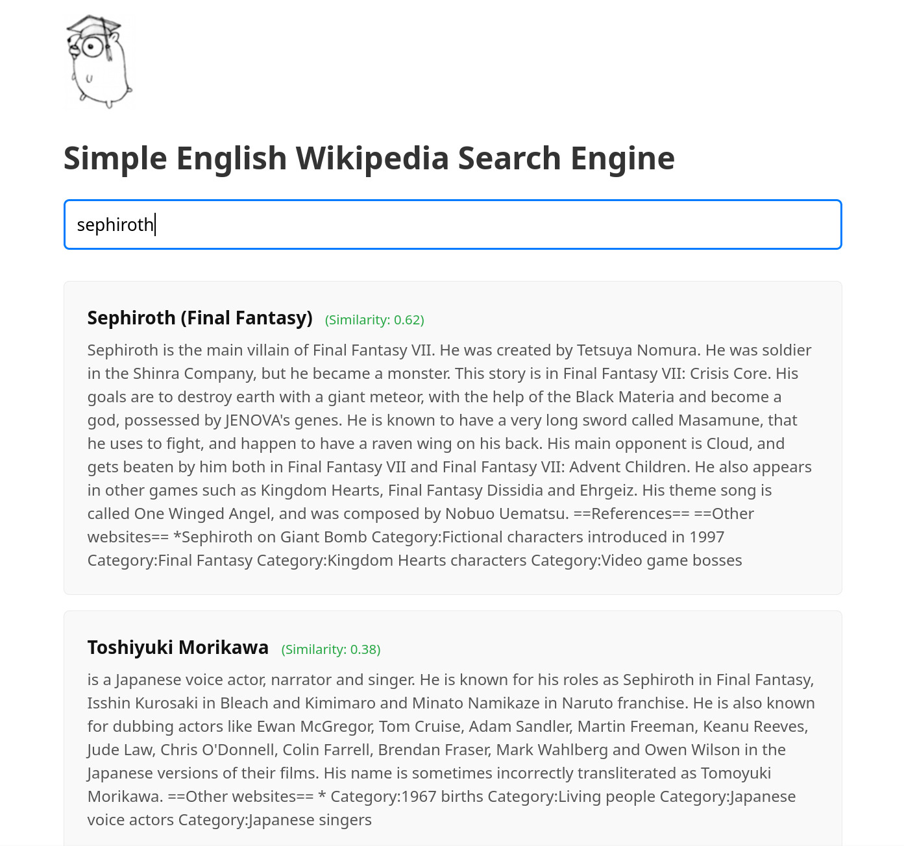

# Simple English Wikipedia Search Engine

A simple search engine written in Go, using SVD and low rank approximation with k = 512 on document and words matrix with BM25-like weight. Data collected from [wikipedia dumps](https://dumps.wikimedia.org/), ~300k articles, containing ~670k unique words (not including numbers, stop-words, etc.). Uses PostgreSQL and pgvector extension to hold vectors of size 512 for each article, allowing HNSW cosine indexing to be used.

To try it yourself, install PostgreSQL with pgvector, get processed articles (for example using https://github.com/daveshap/PlainTextWikipedia) and change constants in `main.go` to point to correct paths, i.e. folder of proccessed articles in json format and postgres path. Then, run `go run .` and the page will be served on `http://localhost:8080`